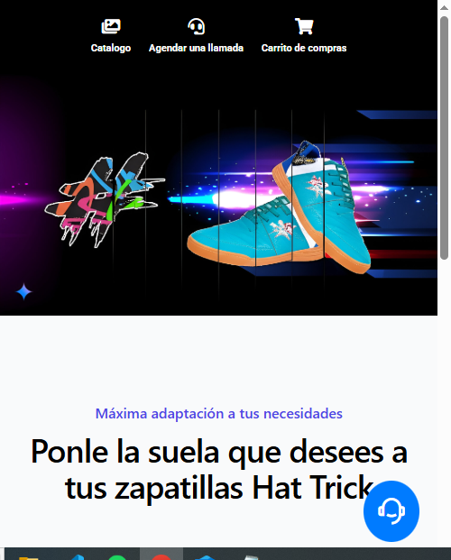
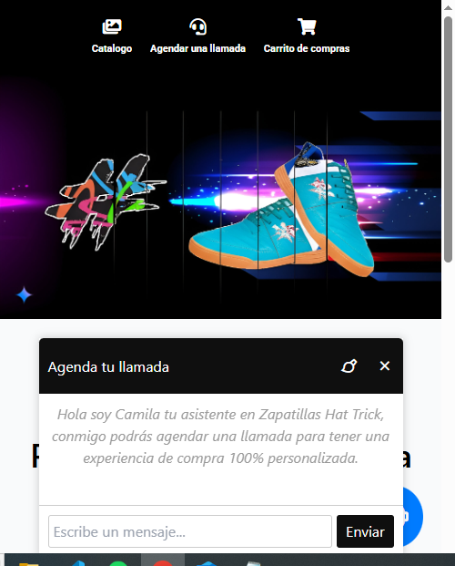

# 🚀 Landing Page con Agente Virtual - Zapatillas Hat Trick

Bienvenido a la **Landing Page de Zapatillas Hat Trick**, una página web diseñada para promocionar la marca y facilitar la interacción con los clientes a través de un **agente virtual inteligente**.

## ✨ Descripción

Esta landing page combina un diseño atractivo y responsivo con un agente virtual integrado para ofrecer una experiencia de usuario completa. El agente virtual ayuda a los clientes a agendar llamadas con asesores de ventas, mejorando la conversión y la satisfacción del cliente.

## 🌟 Características Principales

*   **Landing Page Atractiva:** Diseño moderno y responsivo para una excelente experiencia en cualquier dispositivo.
*   **Agente Virtual Integrado:** Chatbot inteligente para agendar llamadas y responder preguntas frecuentes.
*   **Agendamiento de Llamadas:** Permite a los clientes programar llamadas con asesores de ventas directamente desde el chat.
*   **Integración con API Externa:** Conexión con una API (como n8n) para procesar las respuestas del agente virtual.
*   **Fácil de Usar:** Interfaz intuitiva con un botón flotante para acceder al chat y opciones claras para interactuar con el agente.
*   **Personalizable:** Permite modificar la apariencia y el comportamiento del agente virtual para adaptarlo a las necesidades de la marca.

## 📸 Capturas de Pantalla

### Interfaz de la Landing


### Interfaz del agente**

## 🛠 Tecnologías Utilizadas

*   **HTML5, CSS3 y JavaScript:** Para la estructura, diseño e interactividad de la landing page.
*   **Fetch API:** Para la comunicación con el agente virtual (API externa).
*   **[Nombre de la Plataforma de Agente Virtual]:** n8n Para la lógica y el procesamiento del agente virtual.

## 📦 Instalación

1.  Clona este repositorio:
git clone [https://github.com/kiketach/Agent-Landing-demo.git]

2.  Abre el archivo `index.html` en tu navegador favorito.

## ⚙️ Configuración

1.  **Configura la API del Agente Virtual:** Modifica la URL del webhook en `script.js` para conectar la landing page con tu agente virtual:

    ```javascript
    const response = await fetch("[URL del webhook]", {
    ```

2.  **Personaliza el Agente Virtual:** Configura el comportamiento y las respuestas del agente virtual en la plataforma que estés utilizando (ej: n8n).

## 💡 Uso

*   **Explora la Landing Page:** Navega por las diferentes secciones para conocer los productos y servicios de Zapatillas Hat Trick.
*   **Abre el Chat:** Haz clic en el botón flotante 💬 para iniciar una conversación con el agente virtual.
*   **Agenda una Llamada:** Sigue las instrucciones del agente virtual para programar una llamada con un asesor de ventas.

## 🤝 Contribución

¡Las contribuciones son bienvenidas! Si deseas mejorar esta landing page o el agente virtual, por favor abre un issue o un pull request.

## 📜 Licencia

Este proyecto está bajo la licencia MIT. Puedes usarlo y modificarlo libremente.

---

Desarrollado con ❤️ por kiketach