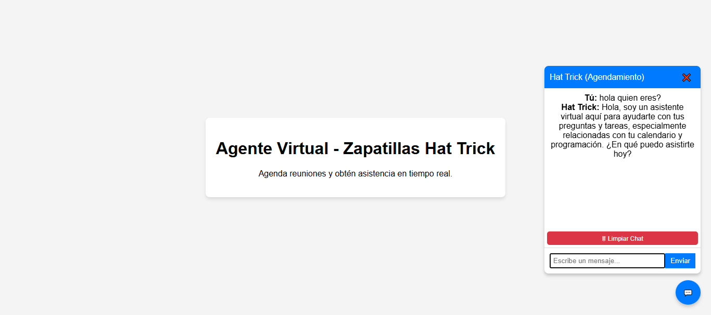

# 🤖 Agente Virtual - Zapatillas Hat Trick

Bienvenido al **Agente Virtual de Zapatillas Hat Trick**, un chatbot diseñado para mejorar la atención al cliente y facilitar el agendamiento de citas.

## 🚀 Características

✅ **Chat interactivo** con clientes en tiempo real.  
✅ **Botón flotante** para activar/desactivar el chat.  
✅ **Conexión con API externa** para procesar respuestas.  
✅ **Limpieza de chat** con un solo clic.  
✅ **Interfaz moderna y responsiva**.  

## 📸 Capturas de pantalla


## 📦 Instalación

1. Clona este repositorio:
   ```bash
   git clone https://github.com/kiketach/Agent-Landing-demo.git
   ```
2. Entra en la carpeta del proyecto:
   
3. Abre el archivo `index.html` en tu navegador favorito.

## ⚙️ Configuración

Si deseas modificar la URL del webhook del agente, edita la línea correspondiente en `script.js`:
```javascript
const response = await fetch("https://eabril.app.n8n.cloud/webhook/agente", {
```

## 💡 Uso

- **Para abrir el chat**, haz clic en el botón flotante 💬.  
- **Para cerrar el chat**, usa el botón ❌ en la parte superior.  
- **Para limpiar el chat**, presiona el botón 🗑 dentro de la ventana del chat.  

## 🛠 Tecnologías utilizadas

- **HTML5** + **CSS3** para la estructura y diseño.
- **JavaScript** para la lógica del chatbot.
- **Fetch API** para la comunicación con el agente conversacional.

## 🌍 Contribución

¡Las contribuciones son bienvenidas! Si deseas mejorar este chatbot, por favor abre un issue o un pull request.

## 📜 Licencia

Este proyecto está bajo la licencia MIT. Puedes usarlo y modificarlo libremente.

---
Desarrollado con ❤️ por [Enrike](https://www.linkedin.com/in/enrique-abril-contreras/).

